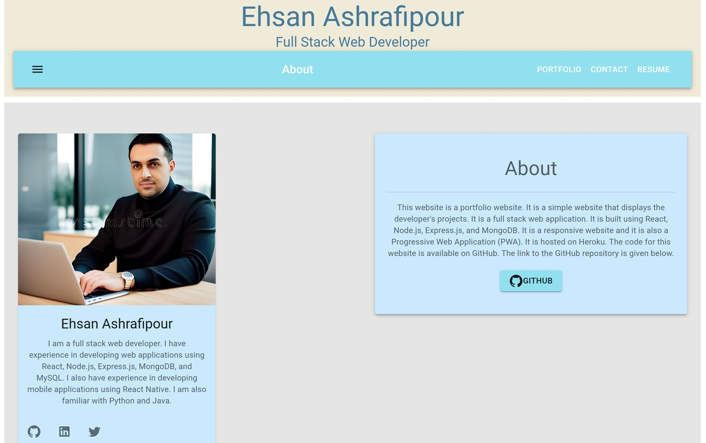

# React Portfolio

---

>Welcome to my React portfolio! This single-page application portfolio is designed for employers like you who are looking for candidates with experience building single-page applications. You can use this portfolio to view my work samples and assess whether I am a good fit for your open position.

---

## Description

>This React portfolio is a single-page application that showcases my work samples and provides information about me as a web developer. It allows you to navigate between different sections of the portfolio without the need for page reloading, providing a smooth user experience. The key features and functionality include:

- A header with my name and navigation links to different sections of the portfolio.
- Navigation titles for "About Me," "Portfolio," "Contact," and "Resume."
- Highlighted navigation titles corresponding to the current section.
- Clicking on a navigation title displays the corresponding section below without page reloading.
- Default selection of the "About Me" section when first loading the portfolio.
- "About Me" section includes a recent photo or avatar and a short bio about me.
- "Portfolio" section displays titled images of six of my applications with links to deployed apps and GitHub repositories.
- "Contact" section provides a contact form with fields for name, email address, and message.
- Field validation and notifications for required fields and invalid email addresses.
- "Resume" section includes a link to download my resume and a list of my proficiencies.
- Footer with links to my GitHub, LinkedIn, and another platform (Stack Overflow, Twitter).

---

## Table of Contents

- [React Portfolio](#react-portfolio)
  - [Description](#description)
  - [Table of Contents](#table-of-contents)
  - [Installation](#installation)
  - [Usage](#usage)
  - [Demo](#demo)
  - [Credits](#credits)
  - [License](#license)
  - [Features](#features)
  - [Contributing](#contributing)
  - [Tests](#tests)
  - [Questions](#questions)

---

## Installation

>To view this React portfolio, you don't need to install anything. You can access it directly through the provided link in Demo Section.

---

## Usage

>Once you have the portfolio running locally or access it through the provided link, you can navigate through the different sections using the navigation links. Here's how you can use the portfolio:

- Click on "About Me" to learn more about me, view my photo, and read a short bio.
- Visit the "Portfolio" section to see images of my applications and access links to both the deployed apps and their GitHub repositories.
- Use the "Contact" section to get in touch with me by filling out the contact form.
- Check out my "Resume" section to download my resume and see my list of proficiencies.
- Feel free to explore and assess my work samples to determine if I am a suitable candidate for your open position.

---

## Demo

[Link to deployed application](https://ehsanashportfolio.netlify.app/)

---

## Credits

>This project uses the following technologies:

- React
- Vite
- NPM
- MUI
- React Router
- ESLint
- Netlify

> I also followed the following documentations:

[Emailjs](https://www.emailjs.com/docs/)
[Netlify](https://www.netlify.com/)
[NPM](https://www.npmjs.com/package/@react-pdf/renderer)
[Vite](https://vitejs.dev/guide/)
[React Router](https://reactrouter.com/en/main/start/overview)
[React](https://react.dev/learn)
[MUI](https://mui.com/material-ui/getting-started/)

---

## License

This project is licensed under the [MIT License](LICENSE).

---

## Features

- Single-page application built with React.
- Smooth navigation between sections without page reloading.
- User-friendly contact form with field validation.
- Downloadable resume and proficiency list.
- Responsive design for a seamless viewing experience on different devices.

---

## Contributing

>Contributions to this portfolio project are welcome! If you have suggestions or want to contribute, follow these steps:

- Fork the repository.
- Create a new branch for your feature or bug fix.
- Commit your changes with clear and descriptive messages.
- Push your branch to your fork.
- Submit a pull request.
- Your contributions will help improve this portfolio and make it even more impressive.

---

## Tests

N/A

---

## Questions

Please visit my GitHub profile:

[GitHub](https://github.com/EhsanAsh)

If you have any questions regarding this Application, please email me at:

[Email Me](ehsan.ashrafipour@gmail.com)